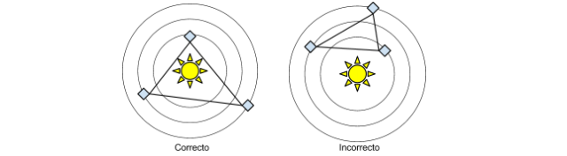

# meli-forecast-core-ms
CONTROLADOR PRINCIPAL PARA LAS PREDICCIONES CLIMATICAS

En una galaxia lejana, existen tres civilizaciones. Vulcanos, Ferengis y Betasoides. Cada
civilización vive en paz en su respectivo planeta.
Dominan la predicción del clima mediante un complejo sistema informático.
A continuación el diagrama del sistema solar.

Premisas:
* El planeta Ferengi se desplaza con una velocidad angular de 1 grados/día en sentido
horario. Su distancia con respecto al sol es de 500Km.
* El planeta Betasoide se desplaza con una velocidad angular de 3 grados/día en sentido
horario. Su distancia con respecto al sol es de 2000Km.
* El planeta Vulcano se desplaza con una velocidad angular de 5 grados/día en sentido
anti­horario, su distancia con respecto al sol es de 1000Km.
* Todas las órbitas son circulares.
Cuando los tres planetas están alineados entre sí y a su vez alineados con respecto al sol, el
sistema solar experimenta un período de sequía.

  
  
  _Antes que nada debemos calcular las posiciones X,Y de cada planeta y del sol para poder aplicar los modelos geométricos de línea, área y perímetro. teniendo la velocidad angular(w) y el radio podemos determinar el ángulo de desplazamiento del planeta en un dia especifico. La precision decimal la coloque en double 10d para tener la mayor cantidad de alineaciones posibles_
  
         w = anguloDesp / tiempo  => anguloDesp = w * tiempo
	 
	 una vez calculado el angulo de desplazamiento tenemos convertimos el angulo que esta en grados a radianes y sustituimos en los modelos 
	 
	 X = r * cos(angulo en radianes) y Y = r * sin(angulo en radianes)_
  
  _Para determinar la alineacion de planetas entre si y a su vez con el sol, utilicé el modelo de colinealidad que es una derivación del modelo de la recta, pero sin tener en consideración cuando la recta es paralela al eje Y, debido a que la pendiente es infinita, una ventaja de usar este modelo es que la ejecución se mantiene en O(1)_
  
   _dos puntos que forman una recta P1(x1,y1) y P2(x2,y2) un terce punto P3(x,y) es colineal si al sustituir los valores de X,Y en el modelo el resultado es cero._
  	
  	s = (y2 - y1) * x + (x1 - x2) * y + (x2 * y1 - x1 * y2); | alineados si s=0
	en el caso del sol P3(0,0)=> x=0, y=0

_De aquí obtenemos que si los puntos están alineados entre sí y a su vez con el sol... Sequía_
_Sí los puntos estan alineados entre sí pero no con el sol... Condiciones óptimas de presión y de temperatura_

_Si los planetas no estan alineados solo queda la opción de que formen un triangulo, habría que determinar si el punto donde se ubica el sol pertenece al área que forma el triangulo; hay dos metodos de hacerlo que mantienen la capacidad de calculo en O(1). Una es por producto vectorial para ver la orientacion del punto mientras se recorre vectorialmente en un mismo sentido (horario o anti-horario) las lineas que forman el poligono convexo que en este caso es el triangulo y otra es por la suma de areas de los triangulos internos que se formarían suponiendo que el punto está dentro del polígono_

## Por producto vectorial
	:::JAVA
	public static boolean sunLiesInTriangleVectorsMethod(List<Point> pointsList){
        Sun sun = new Sun(0, 0);
        Point a = pointsList.get(0), b = pointsList.get(1), c = pointsList.get(2);
        Point psun = sun.getPosition();
        double w1 = ((a.getX()*(c.getY()-a.getY())) + ((psun.getY()-a.getY())*(c.getX()-a.getX())) - ((psun.getX()*(c.getY() - a.getX()))));
        w1 = w1 / (((b.getY()-a.getY())*(c.getX()-a.getX())) - ((b.getX()-a.getX())*(c.getY()-a.getY())));
        double w2 = ((psun.getY()-a.getY())-(w1*(b.getY()-a.getY())))/(c.getY()-a.getY());
        if((w1 >= 0) && (w2 >= 0) && ((w1+w2) <= 1))
            return Boolean.TRUE;
        return Boolean.FALSE;
    }
## Por Area del triangulo
	:::JAVA
	public static double triangleArea(Point a, Point b, Point c){
        //double M = a.getX()*( b.getY() - c.getY() );
        //double N = b.getX() * ( c.getY() - a.getY() );
        //double O = c.getX() * ( a.getY() - b.getY() );
        return ((a.getX()*( b.getY() - c.getY() )) + (b.getX() * ( c.getY() - a.getY() )) + (c.getX() * ( a.getY() - b.getY() )))/2;
    }

## Descripción

Operaciones pertinentes al control de data e información del clima, genera la informacion que se almacena en la base de datos

### Calculo del clima de un día en particular
| URL               | https://meli-forecast-core-ms.herokuapp.com/api/forecast/dayforecast/{id}  |
| ----------        | ------------------------------- |
| __API__               | /api/forecast/dayforecast/{id}  |
| __Método__            | GET                        |
| __Produces__          | application/json                |
| __Consumes__          | application/json                |
| __Path Parametes__    | {id}=Numero del dia a consultar |
| __Response Status__   | 200 OK - OK                     |
| __Response Object__   | String                          |
| __Descripcion__       | Clima del dia consultado a partir de calculo matemático, el valor no está almacenado        |

### Para probar conectividad con el microservicio
| URL               | https://meli-forecast-core-ms.herokuapp.com/api/forecast/fakefordebugg/{fromday}/{atDay}  |
| ----------        | ------------------------------- |
| __API__            | GET                        |
| __Método__            | GET                        |
| __Produces__          | application/json                |
| __Consumes__          | application/json                |
| __Path Parametes__    | {fromday} = dia de inicior {atDay}</code> = Dia final |
| __Response Status__   | 200 OK - OK                     |
| __Response Object__   | String                          |
| __Descripcion__       | su única función es chequear conexion con el microservicio que accede a la base de datos        |

### Genera todos los registros climáticos diarios en un periodo de 10 años
| URL               | https://meli-forecast-core-ms.herokuapp.com/api/forecast/generaterecords/{fromday}/{atday}  |
| ----------        | ------------------------------- |
| __API__            | GET                        |
| __Método__            | GET                        |
| __Produces__          | application/json                |
| __Consumes__          | application/json                |
| __Path Parametes__    | {fromday} = dia de inicior {atDay}</code> = Dia final |
| __Response Status__   | 200 OK - OK                     |
| __Response Object__   | String                          |
| __Descripcion__       | Genera los registros climatologicos diarios, es activado por el Job scheduler y le realiza las request de escritura al microservicio de la BD        |

### Genera un reporte general en base al calculo de los periodos de sequía, lluvia pico máximo de lluvia, y condiciones óptimas de presion y temperatura
| URL               | https://meli-forecast-core-ms.herokuapp.com/api/forecast/totalreport  |
| ----------        | ------------------------------- |
| __API__            | GET                        |
| __Método__            | GET                        |
| __Produces__          | application/json                |
| __Consumes__          | application/json                |
| __Path Parametes__    | N/A |
| __Response Status__   | 200 OK - OK                     |
| __Response Object__   | String                          |
| __Descripcion__       | Genera el reporte total de periodos de clima        |

## La solución del ejercicio a las preguntas

 1.- ¿Cuantos periodos de sequia habrá?
 2.- ¿Cuantos periodos de lluvia habra y que dia sera el pico maximo de lluvia?
 3.- Cuantos periodos de condiciones optimas de presión y temperatura habrá?
 
  Debe ingresar la siguiente URL

 
		https://meli-forecast-core-ms.herokuapp.com/api/forecast/totalreport
  Este genera la siguiente respuesta
  
  	:::Json
		{		
		"responseText": "Total periodos de lluvia: 1760 Total periodos de Sequia: 20 Total periodos de Condiciones optimas: 20 Total de Periodos Nublados: 1839 Dia con pico maximo de lluvia: 67",
		"status": 20
		}
		
## Procedimientos para el funcionamiento

### Direccion de la aplicacion desplegada en Heroku

		https://meli-forecast-core-ms.herokuapp.com/

### Direccion del repositorio en heroku para ser clonadonado

	https://git.heroku.com/meli-forecast-core-ms.git
### Direccion del repositorio en GitHub para ser clonado o ver su codigo en linea

	https://github.com/hectorjcr/meli-forecast-weather-core.git
    
### Direccion de la documentacion para la API REST

		https://meli-forecast-core-ms.herokuapp.com/jsondoc-ui.html
	
	dentro de la barra de busqueda ingresar esta direccion: 
		https://meli-forecast-core-ms.herokuapp.com/jsondoc

